<div align="center">

# 🎸 Guitar Learner

**纯本地运行、无需联网** 的现代吉他学习应用 · 一份代码,Web + Android 双端

[](#-license)
[](https://react.dev)
[](https://vitejs.dev)
[](https://www.typescriptlang.org)
[](#-快速开始)
[](#-它是什么)

<table>
  <tr>
    <td align="center">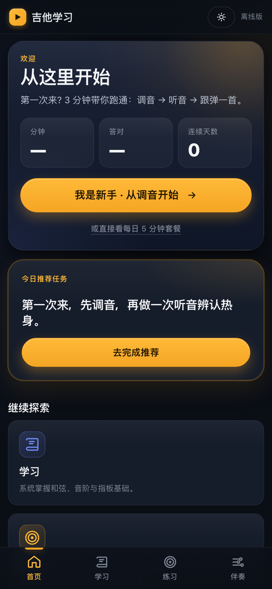</td>
    <td align="center">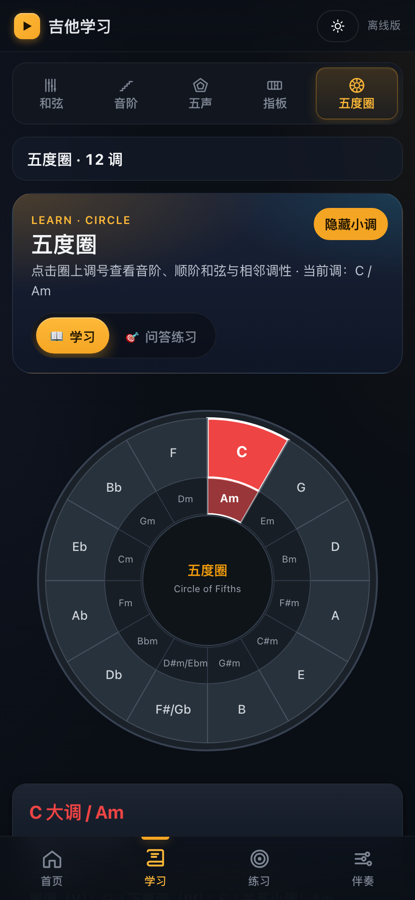</td>
    <td align="center">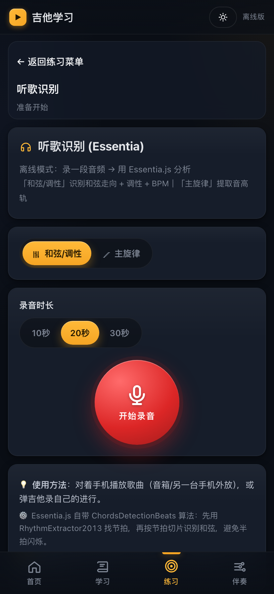</td>
  </tr>
</table>

</div>

---

## 🌟 它是什么

集 **乐理学习** + **麦克风实时识别** + **离线音色合成** + **节奏伴奏** 于一身的离线版瑞士军刀。

- 🔌 **完全离线** —— 零后端、零账号、零网络请求,一次加载处处可用
- 🎚️ **自研音频引擎** —— Web Audio API 物理建模合成吉他/贝斯/鼓机,**零采样包**
- 🎧 **实时和弦识别** —— FFT + Chroma + 156 模板 + 状态机防抖,30+ 轮算法迭代
- 🧠 **离线扒带** —— Essentia.js 一键出 BPM + 调性 + 节拍对齐和弦时间线 + 主旋律 MIDI
- 🥁 **毫秒级精准节奏** —— Web Audio Lookahead Scheduler,锁屏/掉帧不漂移
- 🎨 **设计系统化** —— CSS token + 22 个内联 SVG icon (零依赖) + 微交互, APK 跨厂商字形一致
- 🌗 **深浅双主题** —— 浅色重写、阴影/对比度精修, APK 内 status bar / nav bar 跟随切换

> 📜 历次迭代过程(60+ 轮)与版本变更见 [docs/CHANGELOG.md](docs/CHANGELOG.md)

---

## 📸 界面一览

<table>
  <tr>
    <td align="center" width="25%"><br><sub>① 首页 · 仪表盘</sub></td>
    <td align="center" width="25%">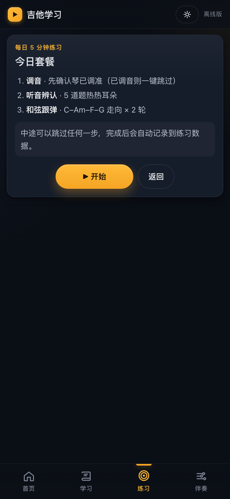<br><sub>② 每日 5 分钟</sub></td>
    <td align="center" width="25%"><br><sub>③ 浅色主题</sub></td>
    <td align="center" width="25%">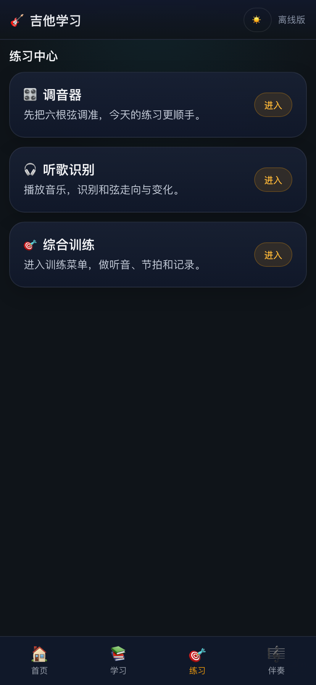<br><sub>④ 练习中心</sub></td>
  </tr>
  <tr>
    <td align="center">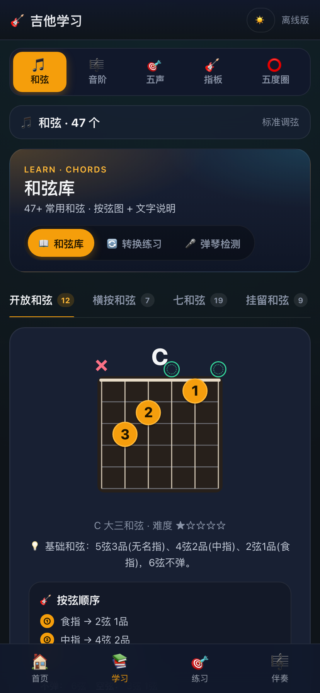<br><sub>⑤ 学习 · 和弦库</sub></td>
    <td align="center">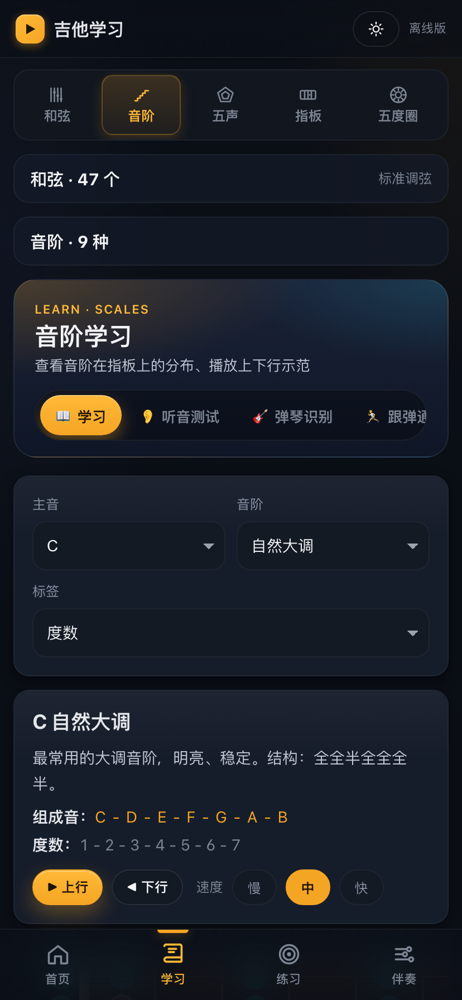<br><sub>⑥ 学习 · 音阶</sub></td>
    <td align="center">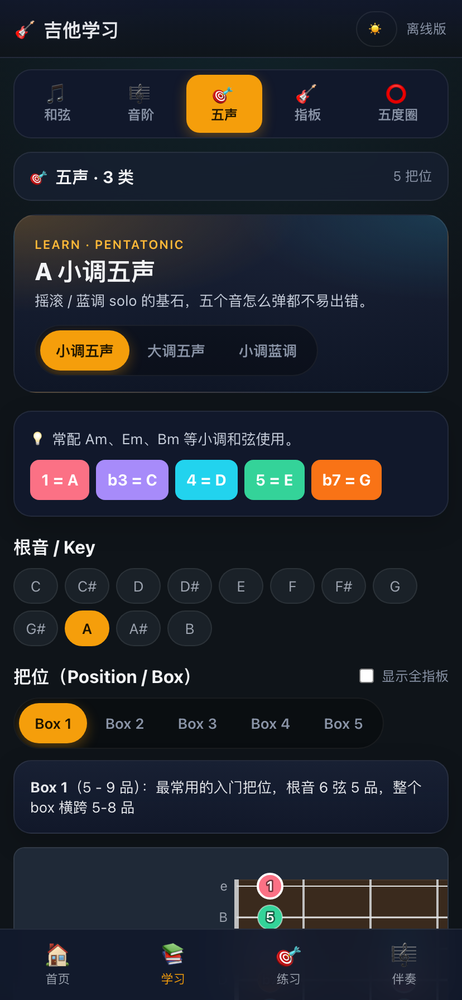<br><sub>⑦ 学习 · 五声</sub></td>
    <td align="center">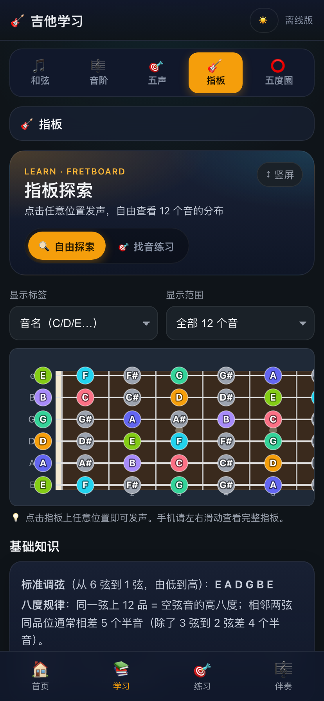<br><sub>⑧ 学习 · 指板探索</sub></td>
  </tr>
  <tr>
    <td align="center">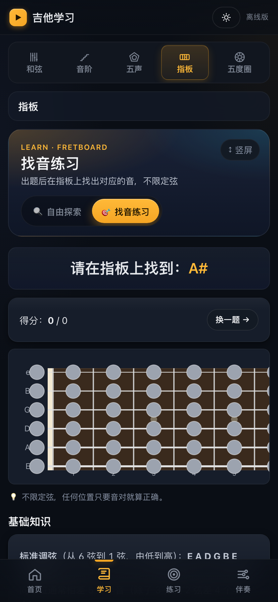<br><sub>⑨ 学习 · 找音练习</sub></td>
    <td align="center"><br><sub>⑩ 学习 · 五度圈</sub></td>
    <td align="center">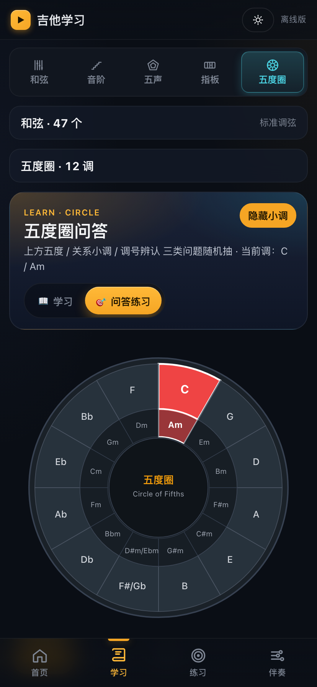<br><sub>⑪ 学习 · 五度圈问答</sub></td>
    <td align="center">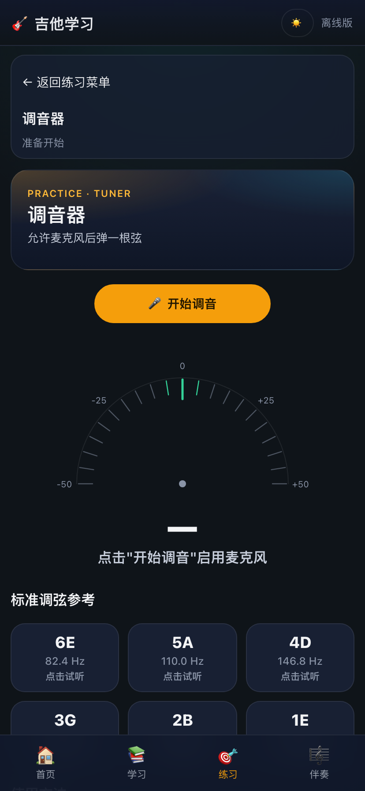<br><sub>⑫ 练习 · 调音器</sub></td>
  </tr>
  <tr>
    <td align="center"><br><sub>⑬ 练习 · 听歌识别</sub></td>
    <td align="center"><br><sub>⑭ 练习 · 综合训练</sub></td>
    <td align="center">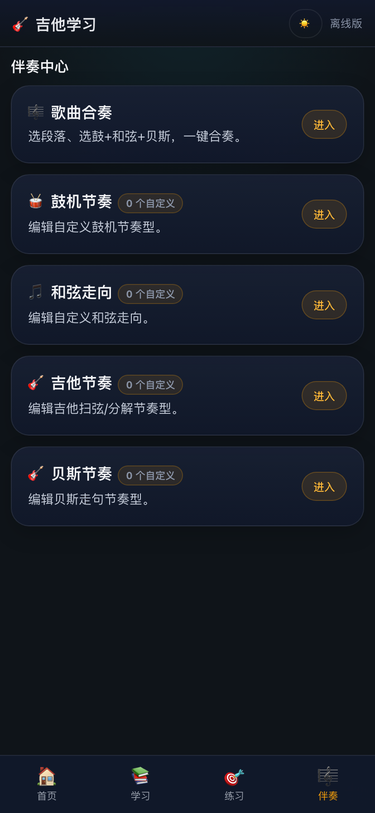<br><sub>⑮ 伴奏中心</sub></td>
    <td align="center">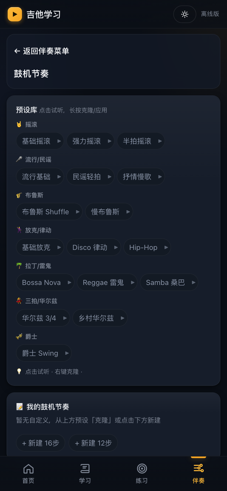<br><sub>⑯ 伴奏 · 鼓机节奏</sub></td>
  </tr>
</table>

<sub>截图来自 Web 端 414×896 移动视口,默认深色主题。运行 `node scripts/capture-screenshots.mjs` 可一键重新生成。</sub>

---

## 🧭 功能导览

应用底部分 **4 大 Tab**,共 16 个 page,**全部离线可用**。

### 🏠 首页 — 仪表盘 + 推荐

练习热力图 / 连续打卡 / 今日累计 / 错题 top · **每日 5 分钟套餐** 3 步串行(调音 → 听音 5 题 → 跟弹 C-Am-F-G × 2)· PWA 一键安装(检测 `beforeinstallprompt`,iOS 自动给手动引导)。

### 📚 学习中心 — 理论与基础

| 子模块 | 内容 | 模式 |
|---|---|---|
| 🎵 **和弦库** | **48 个和弦** · 开放/横按/七和弦/挂留 · 指法图 + 手指标注 · 难度 1-5 星 | 浏览 / 切换练习 / 麦克风识别 |
| 🎼 **音阶** | **10 种**:自然大/小调、和声/旋律小调、五声、蓝调、Dorian、Mixolydian... | 学习 / 听音测试 / 弹琴识别 / 跟弹通关 |
| 🎯 **五声** | 大/小/蓝调 3 类 × **5 个把位**(Position 1-5) | 学习 + 推根音切 key |
| 🎸 **指板** | 12 品全指板 · 横/竖屏自适应 · 音名/唱名/度数三种标签 | 自由探索 / 找音练习 |
| ⭕ **五度圈** | 交互式 SVG · 12 调色块可点 · 自动展开调号/关系大小调/顺阶和弦 | 学习 / 问答练习(上方五度 / 关系小调 / 调号辨认) |

### 🎯 练习中心 — 主动技能训练

3 个入口卡片,综合训练再展开 10 个子项。

| 入口 | 用途 |
|---|---|
| 🎛️ **调音器** | 麦克风 + **YIN 自相关算法** · 6 弦自动识别/手动锁定 · ±50 cents 仪表盘 |
| 🎧 **听歌识别**(Essentia.js) | 录音 10/20/30s → 离线分析 → 输出 BPM + 调性 + **节拍对齐和弦时间线** + 罗马数字 · 主旋律模式(≤15s)直接映射 **最低把位指板** · IndexedDB 持久化 20 条录音 |
| 🎯 **综合训练** | 10 个子项 ↓ |

**综合训练子项:**
| 类别 | 子训练 | 关键细节 |
|---|---|---|
| 听力 | 听音辨认 | 单音 + 大小三和弦,5 题 |
| 听力 | **音准训练** | 麦克风检测 \|cents\|≤15 持 500ms = 命中 |
| 听力 | 和弦听力 | 4 / 6 / 8 选 1 |
| 听力 | 和弦走向 | V→I / IV→I 等功能辨认 |
| 乐理 | 五度圈速答 | 调号 / 关系大小调 / 顺阶 |
| 乐理 | CAGED 系统 | 5 形位置连接 |
| 节奏 | 节拍器 | Lookahead 调度,稳如老狗 |
| 节奏 | 节奏型库 | 跟弹示范 |
| 演奏 | 歌曲跟弹 | 走向切换练习 |
| 数据 | 练习记录 | 今日/累计/热力图 |

### 🎼 伴奏中心 — 节奏与合奏库

5 大模式,**所有 pattern 都可一键克隆为自定义**(localStorage 存)。

| 模式 | 内容 |
|---|---|
| 🎵 **歌曲合奏** | **Intro / Verse / Chorus / Bridge / Outro 分段编排**,鼓 + 和弦扫弦 + 贝斯三轨同步,可加 Fill-in 过门 |
| 🥁 **鼓机节奏库** | **16 种内置**(摇滚 / 流行 / 民谣 / Shuffle / Funk / Disco / Hip-Hop / Bossa / Reggae / Samba / 华尔兹 / Swing 等),自建 16/12 步 pattern |
| 🎼 **和弦走向库** | **12 种内置**:1-6-4-5 / 1-5-6-4 / 卡农 / 12 小节布鲁斯 / 2-5-1 / Doo-Wop / 摇滚 1-5-6-7 等 |
| 🎸 **吉他节奏库** | **13 种扫弦/分解**:DDDD / 万能 D-D-U-U-D-U / Travis Picking / Reggae 反拍 / Funk 切分 / 华尔兹 等 |
| 🎚️ **贝斯节奏库** | **11 种**:只根音 / 根+五度 / 走动贝斯 R-5-R-p5 / 根+高八度 / Funk 切分 等 |

---

## 🛠️ 技术栈

| 层 | 技术 |
|---|---|
| 前端 | React 18 · Vite 5 · TypeScript 5 |
| 路由 | React Router DOM v6(HashRouter,兼容 `file://`) |
| 设计系统 | CSS 变量 token (字号 / 间距 / 阴影 / 色板) · 22 个内联 SVG icon (零依赖) · 深浅双主题 |
| 实时音频 | Web Audio API · `AnalyserNode` (FFT) · 自研 YIN / 模板匹配引擎 |
| 离线分析 | [Essentia.js](https://essentia.upf.edu/essentiajs.html)(WASM,懒加载 ~2.5MB) |
| 录音持久化 | IndexedDB(Float32Array → Blob,上限 20 条) |
| 跨平台壳 | Expo 52 · Expo Router · React Native WebView |
| Android 适配 | `expo-navigation-bar` · `expo-system-ui` · `expo-status-bar` · `react-native-safe-area-context` |

---

## 🚀 快速开始

### Web 端开发

```bash
npm install
npm run dev               # 本地开发服务器
npm run build             # Web 产物 → dist/
npm run build:apk         # APK 用产物(动态 chunk 内联,WebView 离线兼容)
```

### Android App 打包

`native/` 是一套 Expo 壳,通过 [Config Plugin](native/plugins/copy-web-assets.js) 把 Web 产物拷进 `android/app/src/main/assets/web/`,WebView 通过 `file:///android_asset/web/index.html` 离线加载。

```bash
npm run build:apk
node native/scripts/copy-web.js
cd native && npm install
npx expo run:android                           # 本地调试
npx eas build -p android --profile preview     # 云端打 APK
```

云端 EAS 构建会自动跑 `eas-build-pre-install` 钩子(根目录 `build:apk` + `copy-web.js`),无需手动同步。

### 算法回归评测

```bash
npm run eval          # 离线合成 chroma → 模板匹配 · 108 chord × 4 场景
npm run eval:check    # 对比 baseline (CI gate)
npm run eval:update   # 更新基线(谨慎)
npm run eval:song     # 真实歌曲 fixture: vi-IV-I-V × 4
npm run eval:canon    # D 大调卡农真实 wav
```

### 重新生成截图

```bash
npm run build && npx vite preview --port 5174 &
node scripts/capture-screenshots.mjs    # → docs/screenshots/
```

---

## 📁 目录结构

```text
guitar-learner/
├── src/
│   ├── audio/          # 音频引擎(17 个模块)
│   │   ├── synth.ts             # 吉他物理建模合成
│   │   ├── bass-synth.ts        # 贝斯合成(80Hz 加厚)
│   │   ├── drum-machine.ts      # 10 种鼓声纯合成
│   │   ├── pitch-detector.ts    # YIN 自相关音高检测
│   │   ├── chord-detector.ts    # FFT + Chroma + 156 模板 + 状态机
│   │   ├── essentia-engine.ts   # Essentia.js 离线扒带封装
│   │   ├── melodyToFretboard.ts # MIDI → 最低把位推荐
│   │   ├── recordingStore.ts    # IndexedDB 录音持久化
│   │   └── *-patterns.ts        # 鼓 / 和弦走向 / 扫弦 / 贝斯 pattern 库
│   ├── components/     # React 复用组件(指板、和弦图、训练器)
│   ├── pages/          # 16 个路由页面(按 4 大 Hub 组织)
│   ├── theory/         # 乐理数据(48 和弦 · 10 音阶 · 音名转换)
│   ├── data/           # 经典走向数据
│   ├── styles/         # 全局 CSS 与 design token
│   └── utils/          # 振动 · 进度 · 主题 · 自定义库存储
├── native/             # Expo + React Native WebView 壳
│   ├── app/            # 沉浸式全屏容器入口
│   ├── plugins/        # Android Asset 同步 config plugin
│   └── scripts/        # dist → native/assets/web 同步脚本
├── scripts/            # 评测脚本 · baseline · 截图脚本
├── docs/
│   ├── CHANGELOG.md    # 60+ 轮迭代日志
│   └── screenshots/    # README 截图(自动生成)
└── public/             # PWA manifest · sw.js · icon
```

---

## 💡 核心实现亮点

<details>
<summary><b>🎚️ 音频引擎(零采样,纯合成)</b></summary>

- **吉他物理建模** — [`synth.ts`](src/audio/synth.ts) 加法合成:基频 + 多次谐波,各谐波独立衰减率(高频快),经 220Hz peaking 滤波模拟琴体共鸣 + 1200Hz 中频在场感 + 4500Hz 高频低通去刺,DynamicsCompressor 限制器防爆音
- **10 种鼓声零采样** — [`drum-machine.ts`](src/audio/drum-machine.ts) kick/snare/hihat/clap/ride/crash/3 tom 全用振荡器 + 预生成白噪声 + 滤波器
- **Lookahead 节拍调度** — 摒弃 `setInterval`,用 Web Audio 时间戳 + 滚动调度,锁屏/掉帧不漂移
</details>

<details>
<summary><b>🎧 识别算法(每一步都有迭代)</b></summary>

- **和弦检测**([`chord-detector.ts`](src/audio/chord-detector.ts), 796 行) — FFT 峰值 → 12 维 Chroma + 低频 bassChroma + HPS 抑制谐波 + **156 个模板** 余弦匹配 + 状态机(`idle → candidate → confirmed → committed`)+ hysteresis + 速率限制(≤2 chord/s)+ 同根三度族投票(`F#m / F#m7 / F#sus2` 视为一族)
- **3 档敏感度** — `strict` ~3s / `normal` ~1.7s / `loose` ~0.9s commit 阈值
- **自适应处理** — 全局调音偏移自适应(±50 cents)· 自适应噪声地板(p10 估计)· onset 门控(防长按拖尾)· key-aware diatonic 模板先验 · top-K 候选 chip
- **音高检测** — [`pitch-detector.ts`](src/audio/pitch-detector.ts) **YIN 自相关算法**,适合吉他单音
- **离线扒带** — [`essentia-engine.ts`](src/audio/essentia-engine.ts) 封装 Essentia.js `RhythmExtractor2013` + `ChordsDetectionBeats` + `KeyExtractor` + `PitchMelodia`,beat-aligned 不盲猜
</details>

<details>
<summary><b>🧪 工程纪律</b></summary>

- **算法可回归评测** — `scripts/` 内 5 个评测脚本,从合成 chroma 到真实 wav 4 个层级,[`eval-baseline.json`](scripts/eval-baseline.json) 锁死 156 模板 × 20 走向 × 4 场景 ABCD,改算法必须过 baseline gate
- **录音持久化** — [`recordingStore.ts`](src/audio/recordingStore.ts) IndexedDB `Float32Array → Blob` 存 PCM + analysis JSON,跨 session 重听免重算
- **Essentia WASM 懒加载** — ~2.5MB 单例,显式 `.delete()` C++ vector 防 mobile Safari 二次崩
</details>

<details>
<summary><b>📱 Native 沉浸式封装</b></summary>

- **主题双向同步** — Web 端 `setStoredTheme()` 通过 `ReactNativeWebView.postMessage` 推给壳,壳同步驱动 `SystemUI` / `NavigationBar` / `StatusBar`,无白边
- **Android 系统 UI** — `expo-navigation-bar` 接管底栏,`paddingTop = insets.top` 避开刘海,硬件返回键 → WebView `goBack()`
- **EAS 一键** — `eas-build-pre-install` 钩子在云端自动跑根目录 `build:apk` + `copy-web.js`
</details>

---

## 📄 License

[MIT](./LICENSE)

<div align="center">
<sub>Made with 🎸 · Built to learn, not to subscribe</sub>
</div>
